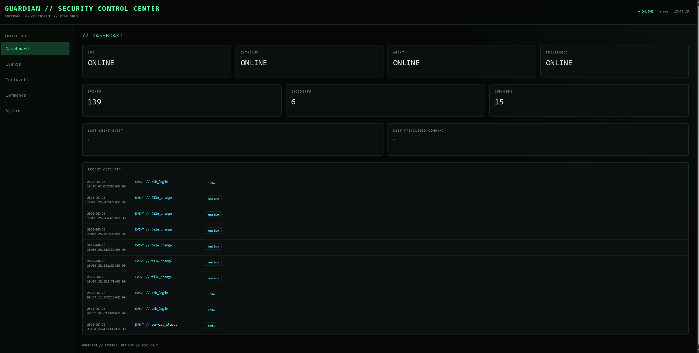

# Guardian

> Linux security monitoring and controlled incident response platform.

Guardian monitors Linux hosts, detects security events, creates incidents and executes controlled automated responses.



## Features

- SSH, Apache, Samba and filesystem monitoring
- Service monitoring
- Lynis and Debsecan integration
- Rule-based incident detection
- Command queue and audit history
- Privileged operations via UNIX socket
- `restart_service`
- `block_ip` / `unblock_ip` using nftables
- Agent heartbeat monitoring
- Read-only SOC-style web dashboard

## Architecture

```text
                 ┌──────────────────────┐
                 │   Web Browser / LAN  │
                 └──────────┬───────────┘
                            │
                            ▼
                 ┌──────────────────────┐
                 │ Orange Pi            │
                 │ Guardian API         │
                 │ FastAPI + SQLite     │
                 │ Web Dashboard        │
                 └──────────┬───────────┘
                            │ HTTP
                            ▼
                 ┌──────────────────────┐
                 │ Ubuntu               │
                 │ Guardian Agent       │
                 │ Collectors / Scanners│
                 │ CommandPoller        │
                 └──────────┬───────────┘
                            │ UNIX socket
                            ▼
                 ┌──────────────────────┐
                 │ Guardian Privileged  │
                 │ root-only operations │
                 │ nftables / systemctl │
                 └──────────────────────┘
```

## Security model

Privileged operations are isolated from the main Agent process.

```text
Agent
  ↓
PrivilegedClient
  ↓
UNIX socket
  ↓
Guardian Privileged
  ↓
controlled root operation
```

The system uses:

- action allowlists
- protected IPs
- input validation
- cooldowns
- rate limits
- persistent command results

## Dashboard

Read-only web dashboard:

`http://GUARDIAN_HOST:8000/`

Includes:

- Dashboard
- Events
- Incidents
- Commands
- System

## Example response flow

```text
Event
  ↓
Rule
  ↓
Incident
  ↓
Reaction
  ↓
Command Queue
  ↓
Privileged execution
  ↓
Audit result
```

Example:

```text
block_ip
   ↓
nftables DROP
   ↓
unblock_ip
   ↓
rule removed
```

## Project structure

```text
guardian-security-monitor/
├── agent/
├── web/
├── api.py
├── storage.py
├── rules.py
├── reactions.py
├── actions.py
├── config.example.yaml
├── README.md
└── LICENSE
```

## Status

Core monitoring, incident detection, command queue, privileged execution, heartbeat and web dashboard are operational.

## Documentation

Full technical documentation is included in the project documentation.

## License

MIT
